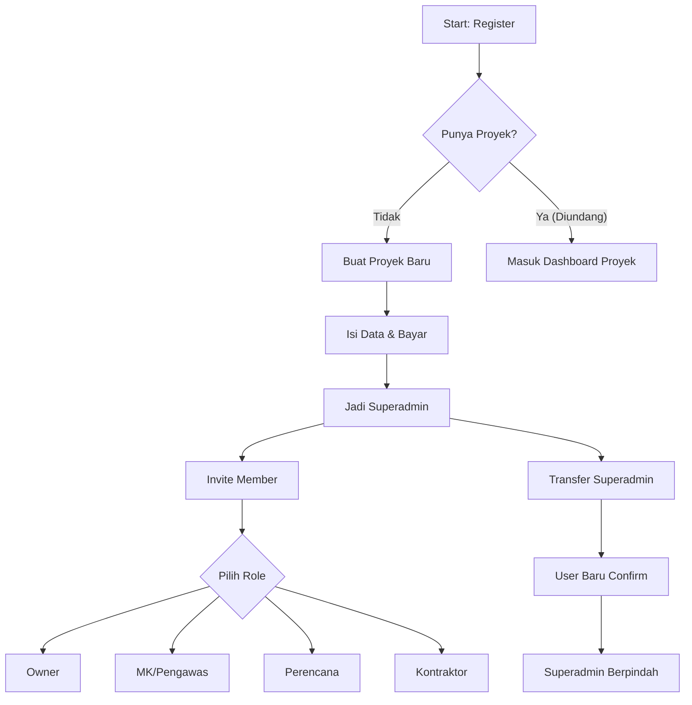

# Alur Pengguna SaaS CDE (Model A)

Dokumen ini menjelaskan alur kerja (workflow) dan pengalaman pengguna (User Experience) untuk platform SaaS CDE, menggunakan pendekatan **Model A** yang sederhana dan langsung (Pay-per-project).

## 1. Prinsip Utama
-   **Simplicity:** Pengguna tidak dibebani pertanyaan role di awal pendaftaran.
-   **Pay-per-Project:** Pembayaran dilakukan per proyek, bukan per user, memudahkan skalabilitas.
-   **Centralized Control:** Superadmin (Project Creator) memiliki kendali penuh di awal, namun fleksibel untuk dialihkan.

## 2. Alur Pendaftaran & Onboarding (Onboarding Flow)

### Langkah 1: Registrasi Pengguna
-   User mendaftar menggunakan **Email** dan **Password** (atau Google Auth).
-   Verifikasi email (OTP/Link).
-   **Status Awal:** User terdaftar sebagai *Free User* (belum memiliki proyek).

### Langkah 2: Pembuatan Proyek (Project Creation)
-   User mengklik tombol **"Buat Proyek Baru"**.
-   User mengisi detail proyek:
    -   Nama Proyek
    -   Lokasi
    -   Deskripsi Singkat
-   User memilih **Paket Langganan** (misal: Starter, Pro, Enterprise) berdasarkan kapasitas storage atau fitur.
-   User melakukan **Pembayaran** (Payment Gateway).
-   **Status Baru:** User otomatis menjadi **Superadmin** (dan merangkap **Project Owner** sementara) untuk proyek tersebut.

### Langkah 3: Mengundang Tim (Invitation)
-   Di dashboard proyek, Superadmin masuk ke menu **"Team / Members"**.
-   Superadmin mengundang anggota tim dengan memasukkan **Email**.
-   Saat mengundang, Superadmin **WAJIB** memilih Role untuk email tersebut:
    -   Project Owner (Wakil/Co-Owner)
    -   Manajemen Konstruksi (MK) / Pengawas
    -   Perencana (Designer)
    -   Kontraktor
    -   End User / Facility Manager
-   Sistem mengirimkan email undangan.
    -   *Jika email belum terdaftar:* Link untuk registrasi -> otomatis masuk proyek.
    -   *Jika email sudah terdaftar:* Notifikasi untuk bergabung ke proyek.

## 3. Manajemen Role & Superadmin

### Definisi Role
1.  **Superadmin (Billing Owner):**
    -   Orang yang membayar dan membuat proyek.
    -   Memiliki akses penuh ke pengaturan billing dan manajemen user.
    -   Bisa menghapus proyek, namun dengan persetujuan dari admin website atau para admin dari seluruh stakeholder dalam proyek tersebut.
    -   Secara default memiliki akses data level *Project Owner*.
2.  **Project Owner:** Pihak pemilik proyek (klien). Bisa Approve dokumen ke *Published*.
3.  **MK / Pengawas:** Mengelola workflow approval (Shared -> Published).
4.  **Perencana:** Upload desain, revisi, koordinasi.
5.  **Kontraktor:** Upload shop drawing, as-built, material approval.
6.  **End User:** View only untuk data serah terima.

### Transfer Superadmin (Handover)
Fitur ini penting jika pembuat proyek (misal: Konsultan IT atau Staff Admin) ingin menyerahkan kepemilikan penuh ke Pemilik Proyek asli.

1.  Superadmin masuk ke **Settings > Transfer Ownership**.
2.  Memilih user target (harus sudah ada di dalam tim dengan role *Project Owner*).
3.  Sistem mengirimkan **Konfirmasi Email** ke user target.
4.  Jika user target menyetujui ("Accept Transfer"), maka:
    -   User target menjadi **Superadmin** baru (Billing Owner).
    -   Superadmin lama turun status menjadi *Member* biasa (atau role lain yang ditentukan).

## 4. Diagram Alur Sederhana

## 5. Keunggulan Model Ini
-   **Zero Friction:** User tidak bingung memilih "Saya siapa?" saat daftar. Identitas mereka ditentukan oleh konteks proyek (di satu proyek bisa jadi Owner, di proyek lain jadi Kontraktor).
-   **Fleksibel:** Mendukung skenario di mana konsultan menyiapkan sistem dulu, baru diserahterimakan ke pemilik.
-   **Monetisasi Jelas:** Tagihan per proyek memudahkan user menghitung biaya (bisa dibebankan ke RAB Proyek).
