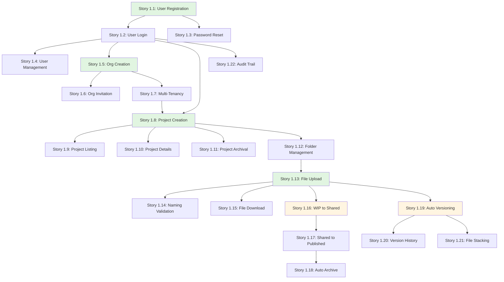

# Epic 1: User Stories Index

**Epic**: Core CDE Foundation & Multi-Tenancy  
**Epic ID**: epic-1  
**Total Stories**: 22  
**Target Phase**: MVP (Phase 1)

## Story Categories

> **Note**: Beberapa stories dikombinasikan dalam satu file untuk efisiensi. Total 22 stories dalam 13 files.

### 1. Authentication & User Management (Stories 1.1 - 1.4)
- [Story 1.1](file:///d:/Coding/Rukon/docs/stories/epic-1/story-1.1-user-registration.md) - User Registration
- [Story 1.2](file:///d:/Coding/Rukon/docs/stories/epic-1/story-1.2-user-login.md) - User Login & Token Management
- [Story 1.3](file:///d:/Coding/Rukon/docs/stories/epic-1/story-1.3-password-reset.md) - Password Reset & Recovery
- [Story 1.4](file:///d:/Coding/Rukon/docs/stories/epic-1/story-1.4-user-management.md) - User Management by Admin

### 2. Organization Management / Multi-Tenancy (Stories 1.5 - 1.7)
- [Story 1.5](file:///d:/Coding/Rukon/docs/stories/epic-1/story-1.5-org-creation.md) - Organization Creation (System Admin)
- [Story 1.6](file:///d:/Coding/Rukon/docs/stories/epic-1/story-1.6-org-invitation.md) - Organization User Invitation
- [Story 1.7](file:///d:/Coding/Rukon/docs/stories/epic-1/story-1.7-multi-tenancy-isolation.md) - Multi-Tenancy Data Isolation

### 3. Project Management (Stories 1.8 - 1.11)
- [Story 1.8](file:///d:/Coding/Rukon/docs/stories/epic-1/story-1.8-project-creation.md) - Project Creation & Management
- [Stories 1.9-1.11](file:///d:/Coding/Rukon/docs/stories/epic-1/story-1.9-1.11-project-operations.md) - Project Listing, Details & Archival *(combined)*

### 4. File Management Core (Stories 1.12 - 1.15)
- [Story 1.12](file:///d:/Coding/Rukon/docs/stories/epic-1/story-1.12-folder-management.md) - Folder Structure Management
- [Story 1.13](file:///d:/Coding/Rukon/docs/stories/epic-1/story-1.13-file-upload.md) - File Upload (Single & Batch)
- [Story 1.14](file:///d:/Coding/Rukon/docs/stories/epic-1/story-1.14-naming-validation.md) - File Naming Convention Validation
- [Stories 1.15-1.18](file:///d:/Coding/Rukon/docs/stories/epic-1/story-1.15-1.18-download-cde-workflow.md) - File Download & CDE Workflow *(combined)*

### 5. CDE Workflow States (Included in Stories 1.15-1.18)
- Story 1.15: File Download & Metadata
- Story 1.16: CDE Workflow - WIP to Shared
- Story 1.17: CDE Workflow - Shared to Published
- Story 1.18: CDE Workflow - Auto Archive

### 6. Smart Versioning & Audit (Stories 1.19 - 1.22)
- [Stories 1.19-1.22](file:///d:/Coding/Rukon/docs/stories/epic-1/story-1.19-1.22-versioning-audit.md) - Smart Versioning & Audit Trail *(combined)*
  - Story 1.19: Auto Version Creation
  - Story 1.20: Version History & Rollback
  - Story 1.21: File Stacking Display
  - Story 1.22: Audit Trail System

## Story Dependency Map

## Story Point Summary

| Story ID | Title | Story Points | Priority |
|----------|-------|--------------|----------|
| 1.1 | User Registration | 5 | P0 |
| 1.2 | User Login | 5 | P0 |
| 1.3 | Password Reset | 3 | P1 |
| 1.4 | User Management | 5 | P1 |
| 1.5 | Org Creation | 3 | P0 |
| 1.6 | Org Invitation | 5 | P1 |
| 1.7 | Multi-Tenancy Isolation | 8 | P0 |
| 1.8 | Project Creation | 5 | P0 |
| 1.9 | Project Listing | 3 | P1 |
| 1.10 | Project Details | 3 | P1 |
| 1.11 | Project Archival | 2 | P2 |
| 1.12 | Folder Management | 5 | P0 |
| 1.13 | File Upload | 8 | P0 |
| 1.14 | Naming Validation | 5 | P0 |
| 1.15 | File Download | 5 | P0 |
| 1.16 | WIP to Shared | 5 | P0 |
| 1.17 | Shared to Published | 5 | P0 |
| 1.18 | Auto Archive | 3 | P1 |
| 1.19 | Auto Versioning | 8 | P0 |
| 1.20 | Version History | 5 | P1 |
| 1.21 | File Stacking | 3 | P1 |
| 1.22 | Audit Trail | 5 | P0 |

**Total Story Points**: ~104 points

## Sprint Recommendations

### Sprint 1 (Weeks 1-2): Authentication & Foundation
- Story 1.1, 1.2, 1.5, 1.7 (Core authentication + Multi-tenancy setup)
- Target: 21 points

### Sprint 2 (Weeks 3-4): Project & Folder Setup
- Story 1.8, 1.9, 1.12, 1.3 (Project management basics)
- Target: 16 points

### Sprint 3 (Weeks 5-6): File Upload & CDE Basics
- Story 1.13, 1.14, 1.15, 1.16 (Core file operations + CDE states)
- Target: 23 points

### Sprint 4 (Weeks 7-8): Versioning System
- Story 1.19, 1.17, 1.20, 1.21 (Smart versioning implementation)
- Target: 21 points

### Sprint 5 (Weeks 9-10): Completion & Refinement
- Story 1.4, 1.6, 1.10, 1.11, 1.18, 1.22 (User management + Audit + Polish)
- Target: 23 points

---

**Created**: 2025-12-01  
**Updated**: 2025-12-01  
**Created by**: SM Agent  
**Total Files**: 16 files (README, SUMMARY, + 13 story files, 1 task.md)  
**Status**: ✅ Story Sharding Complete - Ready for Development

