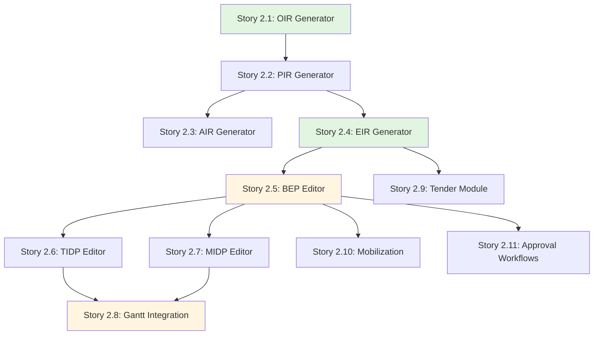

# Epic 2: User Stories Index

**Epic**: ISO 19650-2 Strategic Planning & Delivery Tools  
**Epic ID**: epic-2  
**Total Stories**: 11  
**Target Phase**: Phase 2

## Story Categories

> **Note**: Epic 2 fokus pada tools untuk strategic planning dan delivery phase sesuai ISO 19650-2.

### 1. Document Generators - Information Requirements (Stories 2.1 - 2.4)
- [Story 2.1](file:///d:/Coding/Rukon/docs/stories/epic-2/story-2.1-oir-generator.md) - OIR Generator (Organizational Information Requirements)
- [Story 2.2](file:///d:/Coding/Rukon/docs/stories/epic-2/story-2.2-pir-generator.md) - PIR Generator (Project Information Requirements)
- [Story 2.3](file:///d:/Coding/Rukon/docs/stories/epic-2/story-2.3-air-generator.md) - AIR Generator (Asset Information Requirements)
- [Story 2.4](file:///d:/Coding/Rukon/docs/stories/epic-2/story-2.4-eir-generator.md) - EIR Generator (Exchange Information Requirements)

### 2. Planning Tools Editors (Stories 2.5 - 2.7)
- [Story 2.5](file:///d:/Coding/Rukon/docs/stories/epic-2/story-2.5-bep-editor.md) - BEP Editor (BIM Execution Plan)
- [Story 2.6](file:///d:/Coding/Rukon/docs/stories/epic-2/story-2.6-tidp-editor.md) - TIDP Editor (Task Information Delivery Plan)
- [Story 2.7](file:///d:/Coding/Rukon/docs/stories/epic-2/story-2.7-midp-editor.md) - MIDP Editor (Master Information Delivery Plan)

### 3. Advanced Features (Stories 2.8 - 2.11)
- [Story 2.8](file:///d:/Coding/Rukon/docs/stories/epic-2/story-2.8-gantt-integration.md) - Gantt Chart Integration for TIDP/MIDP
- [Story 2.9](file:///d:/Coding/Rukon/docs/stories/epic-2/story-2.9-tender-module.md) - Tender Module & Secure Data Room
- [Story 2.10](file:///d:/Coding/Rukon/docs/stories/epic-2/story-2.10-mobilization.md) - Team Mobilization Tools
- [Story 2.11](file:///d:/Coding/Rukon/docs/stories/epic-2/story-2.11-approval-workflows.md) - Configurable Approval Workflows

## Story Dependency Map

## Story Point Summary

| Story ID | Title | Story Points | Priority |
|----------|-------|--------------|----------|
| 2.1 | OIR Generator | 5 | P0 |
| 2.2 | PIR Generator | 5 | P0 |
| 2.3 | AIR Generator | 5 | P1 |
| 2.4 | EIR Generator | 8 | P0 |
| 2.5 | BEP Editor | 8 | P0 |
| 2.6 | TIDP Editor | 8 | P0 |
| 2.7 | MIDP Editor | 8 | P0 |
| 2.8 | Gantt Integration | 13 | P1 |
| 2.9 | Tender Module | 8 | P1 |
| 2.10 | Mobilization Tools | 5 | P2 |
| 2.11 | Approval Workflows | 13 | P0 |

**Total Story Points**: ~86 points

## Sprint Recommendations

### Sprint 6 (Weeks 11-12): Information Requirements Generators
- Story 2.1, 2.2, 2.4 (OIR, PIR, EIR generators with templates)
- Target: 18 points

### Sprint 7 (Weeks 13-14): Planning Tools Foundation
- Story 2.5, 2.6 (BEP and TIDP editors)
- Target: 16 points

### Sprint 8 (Weeks 15-16): Advanced Planning & Workflows
- Story 2.7, 2.11 (MIDP editor and Approval workflows)
- Target: 21 points

### Sprint 9 (Weeks 17-18): Integration & Enhancement
- Story 2.8, 2.3 (Gantt integration and AIR generator)
- Target: 18 points

### Sprint 10 (Weeks 19-20): Tender & Mobilization
- Story 2.9, 2.10 (Tender module and Mobilization tools)
- Target: 13 points

---

**Created**: 2025-12-09  
**Updated**: 2025-12-09  
**Created by**: Hybrid Agent (BMad + DOE)  
**Status**: ✅ Epic Structure Created - Ready for Story Development  
**Dependencies**: Epic 1 (Complete)
