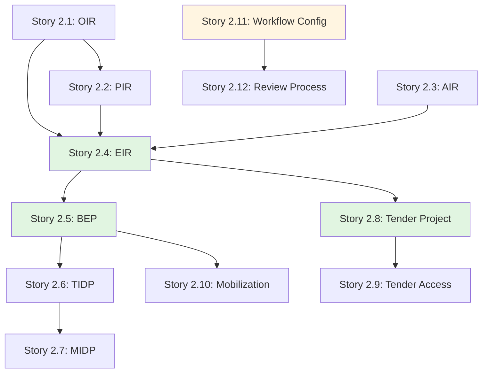

# Epic 2: User Stories Index

**Epic**: ISO 19650-2 Strategic Planning & Delivery  
**Epic ID**: epic-2  
**Total Stories**: 12  
**Target Phase**: Phase 2

## Story Categories

### 1. Strategic Planning Generators (Stories 2.1 - 2.4)
- [Story 2.1](file:///d:/Coding/Rukon/docs/stories/epic-2/story-2.1-oir-generator.md) - OIR Generator (Organizational Information Requirements)
- [Story 2.2](file:///d:/Coding/Rukon/docs/stories/epic-2/story-2.2-pir-generator.md) - PIR Generator (Project Information Requirements)
- [Story 2.3](file:///d:/Coding/Rukon/docs/stories/epic-2/story-2.3-air-generator.md) - AIR Generator (Asset Information Requirements)
- [Story 2.4](file:///d:/Coding/Rukon/docs/stories/epic-2/story-2.4-eir-generator.md) - EIR Generator (Exchange Information Requirements)

### 2. Planning & Delivery Tools (Stories 2.5 - 2.7)
- [Story 2.5](file:///d:/Coding/Rukon/docs/stories/epic-2/story-2.5-bep-editor.md) - BEP Editor (BIM Execution Plan)
- [Story 2.6](file:///d:/Coding/Rukon/docs/stories/epic-2/story-2.6-tidp-editor.md) - TIDP Editor with Gantt Chart
- [Story 2.7](file:///d:/Coding/Rukon/docs/stories/epic-2/story-2.7-midp-aggregation.md) - MIDP Aggregation & Master Schedule

### 3. Tender & Mobilization (Stories 2.8 - 2.10)
- [Story 2.8](file:///d:/Coding/Rukon/docs/stories/epic-2/story-2.8-tender-creation.md) - Tender Project Creation & Data Room
- [Story 2.9](file:///d:/Coding/Rukon/docs/stories/epic-2/story-2.9-tender-access.md) - Tender Access & Activity Logging
- [Story 2.10](file:///d:/Coding/Rukon/docs/stories/epic-2/story-2.10-mobilization.md) - Team Mobilization & Capability Assessment

### 4. Approval Workflows (Stories 2.11 - 2.12)
- [Story 2.11](file:///d:/Coding/Rukon/docs/stories/epic-2/story-2.11-approval-workflows.md) - Configurable Approval Workflows
- [Story 2.12](file:///d:/Coding/Rukon/docs/stories/epic-2/story-2.12-approval-process.md) - Approval Review Process

## Story Dependency Map

## Story Point Summary

| Story ID | Title | Points | Priority |
|----------|-------|--------|----------|
| 2.1 | OIR Generator | 5 | P1 |
| 2.2 | PIR Generator | 3 | P1 |
| 2.3 | AIR Generator | 5 | P1 |
| 2.4 | EIR Generator | 8 | P0 |
| 2.5 | BEP Editor | 8 | P0 |
| 2.6 | TIDP Editor | 8 | P0 |
| 2.7 | MIDP Aggregation | 5 | P0 |
| 2.8 | Tender Project | 5 | P1 |
| 2.9 | Tender Access | 5 | P0 |
| 2.10 | Mobilization | 3 | P2 |
| 2.11 | Workflow Config | 8 | P0 |
| 2.12 | Review Process | 5 | P0 |

**Total Story Points**: 68 points

## Sprint Recommendations

### Sprint 6 (Weeks 11-12): Strategic Generators
- Stories 2.1, 2.2, 2.3, 2.4 (21 points)

### Sprint 7 (Weeks 13-14): Planning Tools
- Stories 2.5, 2.6, 2.7 (21 points)

### Sprint 8 (Weeks 15-16): Tender & Mobilization
- Stories 2.8, 2.9, 2.10 (13 points)

### Sprint 9 (Weeks 17-18): Approvals
- Stories 2.11, 2.12 (13 points)

---

**Created**: 2025-12-01  
**Created by**: SM Agent  
**Status**: ✅ Ready for Development
