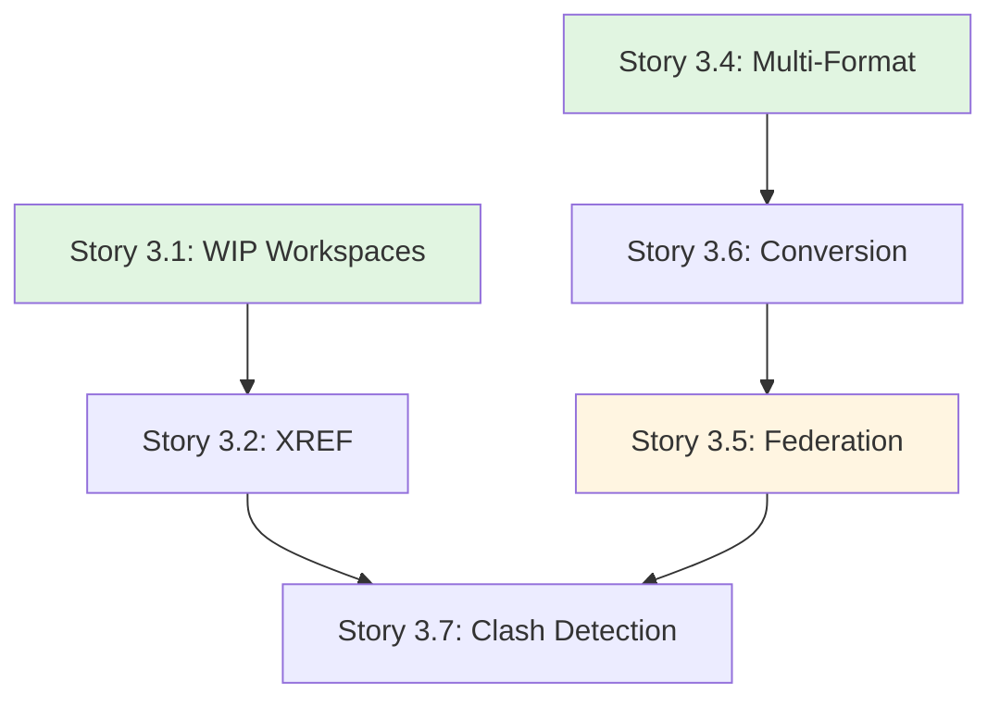

# Epic 3: User Stories Index

**Epic**: Design Collaboration Suite & Model Federation  
**Epic ID**: epic-3  
**Total Stories**: 7  
**Target Phase**: Phase 2

## Story Categories

### 1. Design Collaboration (Stories 3.1 - 3.3)
- [Story 3.1](file:///d:/Coding/Rukon/docs/stories/epic-3/story-3.1-wip-workspaces.md) - WIP Privacy Workspaces
- [Story 3.2](file:///d:/Coding/Rukon/docs/stories/epic-3/story-3.2-reference-management.md) - Reference Management (XREF)
- [Story 3.3](file:///d:/Coding/Rukon/docs/stories/epic-3/story-3.3-design-review.md) - Design Review & Markup Tools (2D/3D)

### 2. Model Management (Stories 3.4, 3.6)
- [Story 3.4](file:///d:/Coding/Rukon/docs/stories/epic-3/story-3.4-multi-format.md) - Multi-Format Support (RVT, DWG, IFC)
- [Story 3.6](file:///d:/Coding/Rukon/docs/stories/epic-3/story-3.6-automated-conversion.md) - Automated Model Conversion (Background Workers)

### 3. Federation & Analysis (Stories 3.5, 3.7)
- [Story 3.5](file:///d:/Coding/Rukon/docs/stories/epic-3/story-3.5-model-federation.md) - Model Federation (Merge Logic)
- [Story 3.7](file:///d:/Coding/Rukon/docs/stories/epic-3/story-3.7-clash-detection.md) - Clash Detection & BCF Export

## Story Dependency Map

## Story Point Summary

| Story ID | Title | Points | Priority |
|----------|-------|--------|----------|
| 3.1 | WIP Privacy Workspaces | 5 | P0 |
| 3.2 | Reference Management | 5 | P1 |
| 3.3 | Design Review Tools | 8 | P1 |
| 3.4 | Multi-Format Support | 5 | P1 |
| 3.5 | Model Federation | 8 | P0 |
| 3.6 | Automated Conversion | 8 | P0 |
| 3.7 | Clash Detection | 8 | P1 |

**Total Story Points**: 47 points

## Sprint Recommendations

### Sprint 10 (Weeks 19-20): Design Collab
- Stories 3.1, 3.2, 3.3 (18 points)

### Sprint 11 (Weeks 21-22): Model Management
- Stories 3.4, 3.6 (13 points)

### Sprint 12 (Weeks 23-24): Federation & Analysis
- Stories 3.5, 3.7 (16 points)

---

**Created**: 2025-12-01  
**Created by**: SM Agent  
**Status**: ✅ Ready for Development
