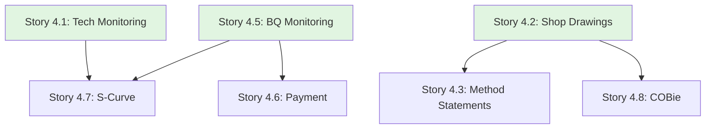

# Epic 4: User Stories Index

**Epic**: Construction Monitoring & Document Control  
**Epic ID**: epic-4  
**Total Stories**: 9  
**Target Phase**: Phase 2

## Story Categories

### 1. Technical Monitoring (Stories 4.1, 4.9)
- [Story 4.1](file:///d:/Coding/Rukon/docs/stories/epic-4/story-4.1-technical-monitoring.md) - Technical Monitoring Dashboard
- [Story 4.9](file:///d:/Coding/Rukon/docs/stories/epic-4/story-4.9-correspondence-log.md) - Correspondence Log (Site Memos/SI)

### 2. Document Control (Stories 4.2, 4.3, 4.8)
- [Story 4.2](file:///d:/Coding/Rukon/docs/stories/epic-4/story-4.2-shop-drawings.md) - Shop Drawings Management
- [Story 4.3](file:///d:/Coding/Rukon/docs/stories/epic-4/story-4.3-method-statements.md) - Method Statements & Material Approvals
- [Story 4.8](file:///d:/Coding/Rukon/docs/stories/epic-4/story-4.8-cobie-health-check.md) - COBie Health Check

### 3. Commercial & Project Control (Stories 4.4 - 4.7)
- [Story 4.4](file:///d:/Coding/Rukon/docs/stories/epic-4/story-4.4-procurement-tracking.md) - Procurement Tracking (LLI)
- [Story 4.5](file:///d:/Coding/Rukon/docs/stories/epic-4/story-4.5-bq-monitoring.md) - BQ Monitoring & Variance Analysis
- [Story 4.6](file:///d:/Coding/Rukon/docs/stories/epic-4/story-4.6-payment-billing.md) - Payment & Billing (Progress Claims)
- [Story 4.7](file:///d:/Coding/Rukon/docs/stories/epic-4/story-4.7-s-curve.md) - S-Curve Visualization

## Story Dependency Map

## Story Point Summary

| Story ID | Title | Points | Priority |
|----------|-------|--------|----------|
| 4.1 | Technical Monitoring | 5 | P0 |
| 4.2 | Shop Drawings | 8 | P0 |
| 4.3 | Method Statements | 5 | P1 |
| 4.4 | Procurement Tracking | 5 | P1 |
| 4.5 | BQ Monitoring | 8 | P0 |
| 4.6 | Payment & Billing | 8 | P0 |
| 4.7 | S-Curve | 8 | P1 |
| 4.8 | COBie Health Check | 8 | P2 |
| 4.9 | Correspondence Log | 3 | P1 |

**Total Story Points**: 58 points

## Sprint Recommendations

### Sprint 13 (Weeks 25-26): Monitoring & Docs
- Stories 4.1, 4.2, 4.9 (16 points)

### Sprint 14 (Weeks 27-28): Commercial Setup
- Stories 4.3, 4.4, 4.5 (18 points)

### Sprint 15 (Weeks 29-30): Financials & Analysis
- Stories 4.6, 4.7, 4.8 (24 points)

---

**Created**: 2025-12-02  
**Created by**: SM Agent  
**Status**: ✅ Ready for Development
