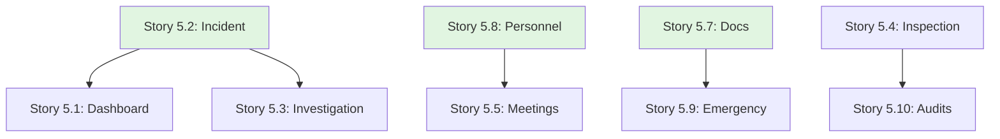

# Epic 5: User Stories Index

**Epic**: HSE Management & Safety Monitoring (K3)  
**Epic ID**: epic-5  
**Total Stories**: 10  
**Target Phase**: Phase 3

## Story Categories

### 1. Safety Dashboard & Incidents (Stories 5.1 - 5.3)
- [Story 5.1](file:///d:/Coding/Rukon/docs/stories/epic-5/story-5.1-safety-dashboard.md) - Safety Dashboard (Manhours, LTI Rates)
- [Story 5.2](file:///d:/Coding/Rukon/docs/stories/epic-5/story-5.2-incident-reporting.md) - Incident Reporting & Management
- [Story 5.3](file:///d:/Coding/Rukon/docs/stories/epic-5/story-5.3-incident-investigation.md) - Incident Investigation & RCA

### 2. Operational Safety (Stories 5.4 - 5.6)
- [Story 5.4](file:///d:/Coding/Rukon/docs/stories/epic-5/story-5.4-safety-inspections.md) - Safety Inspections (Mobile Checklist)
- [Story 5.5](file:///d:/Coding/Rukon/docs/stories/epic-5/story-5.5-safety-meetings.md) - Safety Meetings (TBM, P2K3)
- [Story 5.6](file:///d:/Coding/Rukon/docs/stories/epic-5/story-5.6-permit-to-work.md) - Permit to Work (PTW) System

### 3. HSE Administration (Stories 5.7 - 5.10)
- [Story 5.7](file:///d:/Coding/Rukon/docs/stories/epic-5/story-5.7-hse-documentation.md) - HSE Documentation (SOP, JSA, MSDS)
- [Story 5.8](file:///d:/Coding/Rukon/docs/stories/epic-5/story-5.8-personnel-management.md) - Personnel Management (Safety Cards, Training)
- [Story 5.9](file:///d:/Coding/Rukon/docs/stories/epic-5/story-5.9-emergency-management.md) - Emergency Management (Drills, Plans)
- [Story 5.10](file:///d:/Coding/Rukon/docs/stories/epic-5/story-5.10-internal-audits.md) - Internal Audits (ISO 45001)

## Story Dependency Map

## Story Point Summary

| Story ID | Title | Points | Priority |
|----------|-------|--------|----------|
| 5.1 | Safety Dashboard | 5 | P0 |
| 5.2 | Incident Reporting | 5 | P0 |
| 5.3 | Incident Investigation | 8 | P1 |
| 5.4 | Safety Inspections | 5 | P0 |
| 5.5 | Safety Meetings | 3 | P1 |
| 5.6 | Permit to Work | 8 | P0 |
| 5.7 | HSE Documentation | 5 | P1 |
| 5.8 | Personnel Management | 5 | P1 |
| 5.9 | Emergency Management | 3 | P2 |
| 5.10 | Internal Audits | 8 | P2 |

**Total Story Points**: 55 points

## Sprint Recommendations

### Sprint 16 (Weeks 31-32): Incidents & Dashboard
- Stories 5.1, 5.2, 5.3 (18 points)

### Sprint 17 (Weeks 33-34): Operational Safety
- Stories 5.4, 5.5, 5.6 (16 points)

### Sprint 18 (Weeks 35-36): Admin & Emergency
- Stories 5.7, 5.8, 5.9, 5.10 (21 points)

---

**Created**: 2025-12-02  
**Created by**: SM Agent  
**Status**: ✅ Ready for Development
