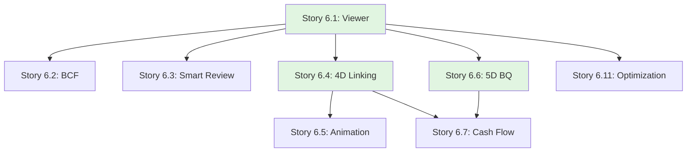

# Epic 6: User Stories Index

**Epic**: Advanced BIM Simulation (4D/5D)  
**Epic ID**: epic-6  
**Total Stories**: 11  
**Target Phase**: Phase 3

## Story Categories

### 1. Smart Review & Open BIM (Stories 6.1 - 6.3)
- [Story 6.1](file:///d:/Coding/Rukon/docs/stories/epic-6/story-6.1-web-ifc-viewer.md) - Web IFC Viewer (Open BIM)
- [Story 6.2](file:///d:/Coding/Rukon/docs/stories/epic-6/story-6.2-bcf-issue-tracking.md) - BCF Issue Tracking (API v2.1/v3.0)
- [Story 6.3](file:///d:/Coding/Rukon/docs/stories/epic-6/story-6.3-smart-review.md) - Smart Review & Change Analysis (2D/3D Diff)

### 2. 4D/5D Simulation (Stories 6.4 - 6.7)
- [Story 6.4](file:///d:/Coding/Rukon/docs/stories/epic-6/story-6.4-4d-schedule-linking.md) - 4D Schedule Linking (Time + Model)
- [Story 6.5](file:///d:/Coding/Rukon/docs/stories/epic-6/story-6.5-4d-timeline-animation.md) - 4D Timeline Animation (Playback)
- [Story 6.6](file:///d:/Coding/Rukon/docs/stories/epic-6/story-6.6-5d-bq-integration.md) - 5D BQ Integration (Cost + Model)
- [Story 6.7](file:///d:/Coding/Rukon/docs/stories/epic-6/story-6.7-cash-flow-simulation.md) - Cash Flow Simulation (Time + Cost)

### 3. Technical Enablers (Stories 6.8 - 6.11)
- [Story 6.8](file:///d:/Coding/Rukon/docs/stories/epic-6/story-6.8-classification-systems.md) - Classification Systems (Uniclass/OmniClass)
- [Story 6.9](file:///d:/Coding/Rukon/docs/stories/epic-6/story-6.9-loin-ids-validation.md) - LOIN/IDS Validation (Information Delivery)
- [Story 6.10](file:///d:/Coding/Rukon/docs/stories/epic-6/story-6.10-advanced-model-querying.md) - Advanced Model Querying (SQL-like)
- [Story 6.11](file:///d:/Coding/Rukon/docs/stories/epic-6/story-6.11-model-optimization.md) - Model Optimization (LOD & Streaming)

## Story Dependency Map

## Story Point Summary

| Story ID | Title | Points | Priority |
|----------|-------|--------|----------|
| 6.1 | Web IFC Viewer | 8 | P0 |
| 6.2 | BCF Issue Tracking | 8 | P0 |
| 6.3 | Smart Review (Diff) | 8 | P1 |
| 6.4 | 4D Schedule Linking | 8 | P0 |
| 6.5 | 4D Animation | 5 | P1 |
| 6.6 | 5D BQ Integration | 8 | P0 |
| 6.7 | Cash Flow Simulation | 5 | P1 |
| 6.8 | Classification Systems | 5 | P2 |
| 6.9 | LOIN/IDS Validation | 8 | P1 |
| 6.10 | Advanced Querying | 5 | P2 |
| 6.11 | Model Optimization | 8 | P0 |

**Total Story Points**: 76 points

## Sprint Recommendations

### Sprint 19 (Weeks 37-38): Open BIM Core
- Stories 6.1, 6.2, 6.3 (24 points)

### Sprint 20 (Weeks 39-40): 4D Simulation
- Stories 6.4, 6.5 (13 points) + Refinement

### Sprint 21 (Weeks 41-42): 5D Cost
- Stories 6.6, 6.7 (13 points) + Refinement

### Sprint 22 (Weeks 43-44): Advanced Features
- Stories 6.8, 6.9, 6.10, 6.11 (26 points)

---

**Created**: 2025-12-02  
**Created by**: SM Agent  
**Status**: ✅ Ready for Development
