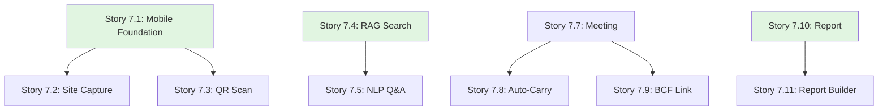

# Epic 7: User Stories Index

**Epic**: Mobile AI Assistant  
**Epic ID**: epic-7  
**Total Stories**: 11  
**Target Phase**: Phase 3-4

## Story Categories

### 1. Mobile Field App (Stories 7.1 - 7.3)
- [Story 7.1](file:///d:/Coding/Rukon/docs/stories/epic-7/story-7.1-mobile-app-foundation.md) - Mobile App Foundation (Offline-First)
- [Story 7.2](file:///d:/Coding/Rukon/docs/stories/epic-7/story-7.2-site-capture.md) - Site Capture (Photo/Video & GPS)
- [Story 7.3](file:///d:/Coding/Rukon/docs/stories/epic-7/story-7.3-qr-scanning.md) - QR Scanning (Asset/Room Lookup)

### 2. AI Project Assistant (Stories 7.4 - 7.6)
- [Story 7.4](file:///d:/Coding/Rukon/docs/stories/epic-7/story-7.4-ai-document-search.md) - AI Document Search (RAG Engine)
- [Story 7.5](file:///d:/Coding/Rukon/docs/stories/epic-7/story-7.5-natural-language-queries.md) - Natural Language Queries (Q&A)
- [Story 7.6](file:///d:/Coding/Rukon/docs/stories/epic-7/story-7.6-ai-risk-insights.md) - AI Risk Insights (Predictive Analysis)

### 3. Meeting Management (Stories 7.7 - 7.9)
- [Story 7.7](file:///d:/Coding/Rukon/docs/stories/epic-7/story-7.7-meeting-management.md) - Meeting Management (Agenda & Minutes)
- [Story 7.8](file:///d:/Coding/Rukon/docs/stories/epic-7/story-7.8-auto-carry-over.md) - Auto-Carry Over (Action Items)
- [Story 7.9](file:///d:/Coding/Rukon/docs/stories/epic-7/story-7.9-bcf-linked-meeting-items.md) - BCF-Linked Meeting Items

### 4. Automated Reporting (Stories 7.10 - 7.11)
- [Story 7.10](file:///d:/Coding/Rukon/docs/stories/epic-7/story-7.10-automated-reporting.md) - Automated Reporting (Weekly/Monthly)
- [Story 7.11](file:///d:/Coding/Rukon/docs/stories/epic-7/story-7.11-custom-report-builder.md) - Custom Report Builder (Drag-and-Drop)

## Story Dependency Map

## Story Point Summary

| Story ID | Title | Points | Priority |
|----------|-------|--------|----------|
| 7.1 | Mobile App Foundation | 8 | P0 |
| 7.2 | Site Capture | 5 | P0 |
| 7.3 | QR Scanning | 3 | P1 |
| 7.4 | AI Document Search (RAG) | 8 | P0 |
| 7.5 | Natural Language Queries | 8 | P0 |
| 7.6 | AI Risk Insights | 8 | P1 |
| 7.7 | Meeting Management | 5 | P1 |
| 7.8 | Auto-Carry Over | 3 | P2 |
| 7.9 | BCF-Linked Items | 5 | P1 |
| 7.10 | Automated Reporting | 8 | P0 |
| 7.11 | Custom Report Builder | 8 | P1 |

**Total Story Points**: 69 points

## Sprint Recommendations

### Sprint 23 (Weeks 45-46): Mobile Foundation
- Stories 7.1, 7.2, 7.3 (16 points)

### Sprint 24 (Weeks 47-48): AI Assistant
- Stories 7.4, 7.5, 7.6 (24 points)

### Sprint 25 (Weeks 49-50): Meeting Management
- Stories 7.7, 7.8, 7.9 (13 points) + Refinement

### Sprint 26 (Weeks 51-52): Automated Reporting
- Stories 7.10, 7.11 (16 points)

---

**Created**: 2025-12-02  
**Created by**: SM Agent  
**Status**: ✅ Ready for Development
