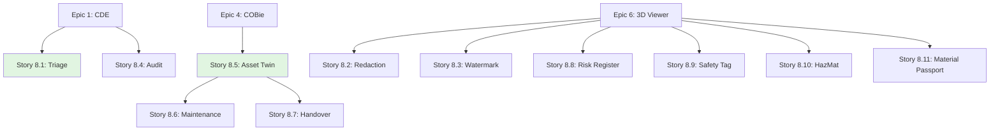

# Epic 8: User Stories Index

**Epic**: Security, Compliance & Asset Lifecycle  
**Epic ID**: epic-8  
**Total Stories**: 11  
**Target Phase**: Phase 3-4

## Story Categories

### 1. Security & Compliance (ISO 19650-5) (Stories 8.1 - 8.4)
- [Story 8.1](file:///d:/Coding/Rukon/docs/stories/epic-8/story-8.1-sensitivity-triage.md) - Sensitivity Triage & Classification
- [Story 8.2](file:///d:/Coding/Rukon/docs/stories/epic-8/story-8.2-redaction-tools.md) - Redaction Tools (2D/3D)
- [Story 8.3](file:///d:/Coding/Rukon/docs/stories/epic-8/story-8.3-dynamic-watermarking.md) - Dynamic Watermarking
- [Story 8.4](file:///d:/Coding/Rukon/docs/stories/epic-8/story-8.4-enhanced-audit-trail.md) - Enhanced Audit Trail

### 2. Operational Phase (ISO 19650-3) (Stories 8.5 - 8.7)
- [Story 8.5](file:///d:/Coding/Rukon/docs/stories/epic-8/story-8.5-asset-twin-aim.md) - Asset Twin (AIM Database)
- [Story 8.6](file:///d:/Coding/Rukon/docs/stories/epic-8/story-8.6-maintenance-scheduler.md) - Maintenance Scheduler
- [Story 8.7](file:///d:/Coding/Rukon/docs/stories/epic-8/story-8.7-handover-wizard.md) - Handover Wizard (PIM to AIM)

### 3. Health & Safety (ISO 19650-6) (Stories 8.8 - 8.9)
- [Story 8.8](file:///d:/Coding/Rukon/docs/stories/epic-8/story-8.8-risk-register.md) - Risk Register
- [Story 8.9](file:///d:/Coding/Rukon/docs/stories/epic-8/story-8.9-visual-safety-tagging.md) - Visual Safety Tagging (3D)

### 4. Deconstruction (ISO 19650-7) (Stories 8.10 - 8.11)
- [Story 8.10](file:///d:/Coding/Rukon/docs/stories/epic-8/story-8.10-hazmat-mapping.md) - HazMat Mapping
- [Story 8.11](file:///d:/Coding/Rukon/docs/stories/epic-8/story-8.11-material-passport.md) - Material Passport (Circular Economy)

## Story Dependency Map

## Story Point Summary

| Story ID | Title | Points | Priority |
|----------|-------|--------|----------|
| 8.1 | Sensitivity Triage | 5 | P0 |
| 8.2 | Redaction Tools | 8 | P1 |
| 8.3 | Dynamic Watermarking | 5 | P1 |
| 8.4 | Enhanced Audit Trail | 5 | P0 |
| 8.5 | Asset Twin (AIM) | 8 | P0 |
| 8.6 | Maintenance Scheduler | 8 | P1 |
| 8.7 | Handover Wizard | 5 | P1 |
| 8.8 | Risk Register | 5 | P1 |
| 8.9 | Visual Safety Tagging | 5 | P2 |
| 8.10 | HazMat Mapping | 5 | P2 |
| 8.11 | Material Passport | 8 | P2 |

**Total Story Points**: 67 points

## Sprint Recommendations

### Sprint 27 (Weeks 53-54): Security & Compliance
- Stories 8.1, 8.2, 8.3, 8.4 (23 points)

### Sprint 28 (Weeks 55-56): Operational Phase
- Stories 8.5, 8.6, 8.7 (21 points)

### Sprint 29 (Weeks 57-58): Health, Safety & Deconstruction
- Stories 8.8, 8.9, 8.10, 8.11 (23 points)

---

**Created**: 2025-12-02  
**Created by**: SM Agent  
**Status**: ✅ Ready for Development
